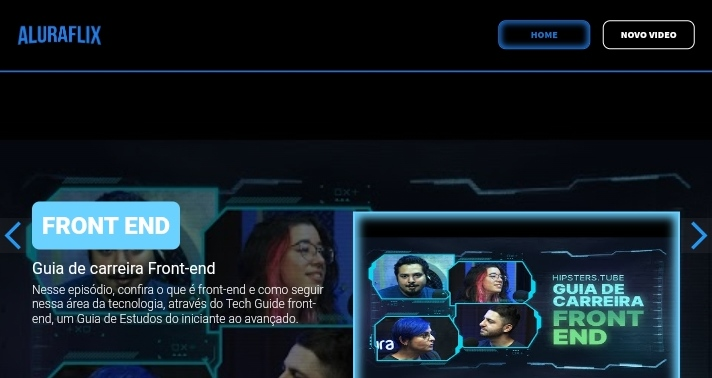

<h1 align="center"> Challenge Alura-Flix </h1>

Neste desafio foi desenvolvido o Alura-Flix, uma plataforma de videos onde pode-se cadastrar e fazer a listagem de videos com tema: programação.

## Tecnologias utilizadas:
* React
* Git/Github
  
## Screenshots
